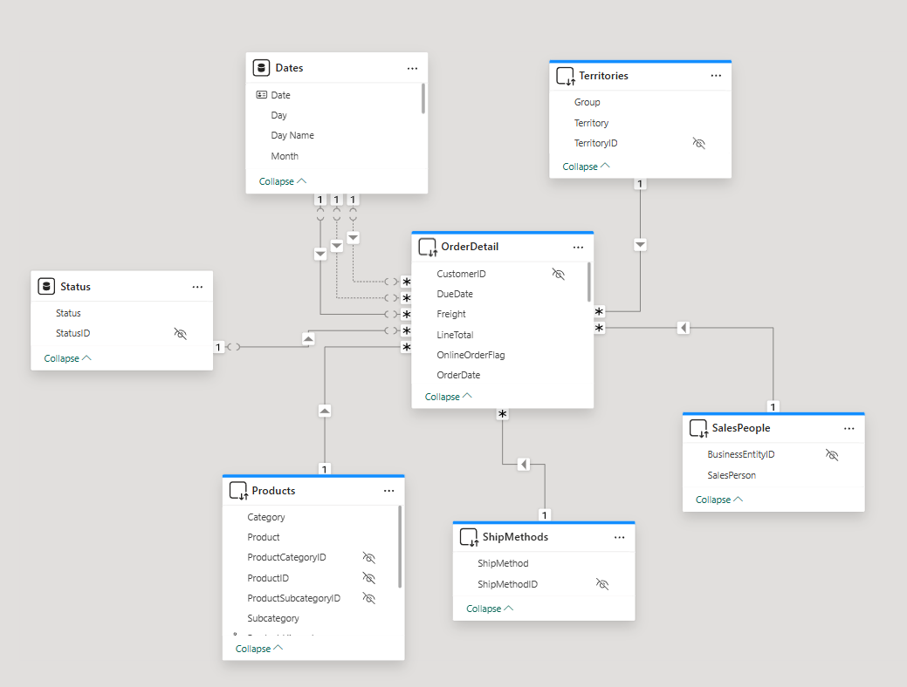
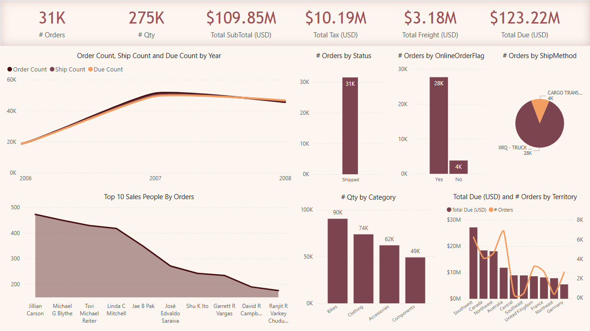

# Sales-Analysis-Dashboard-PowerBI

This project is an **interactive sales dashboard** developed using Power BI as part of my training at the **Information Technology Institute (ITI)**.  
It provides key insights into sales performance, shipping efficiency, and regional revenue distribution.

---

## 🧩 Data Model Overview

The data model follows a star schema structure to support efficient reporting and analysis.

- The **fact table** `OrderDetail` contains essential numeric measures such as `LineTotal`, `TaxAmt`, `Freight`, and due dates.
- It connects to several **dimension tables**, including:
  - `Dates`: for filtering and comparing by Order, Ship, and Due Dates.
  - `Products`: for category-based analysis.
  - `SalesPeople`: for performance metrics.
  - `Territories`: for regional insights.
  - `Status` and `ShipMethods`: to analyze order status and shipping channels.

This setup enables flexible time-based comparisons and clear relationship management in the model.

### 🔹 Data Model in Power BI

---

## 📊 Dashboard Highlights

The dashboard provides an overview of the entire sales pipeline.

Key insights include:

- The total number of orders and total quantity sold.
- Sales trends across years (notably higher in 2007).
- Online orders make up the vast majority.
- All orders in the dataset are marked as "Shipped".
- Most orders were delivered via the XRQ - TRUCK shipping method.

Top-performing product categories include:

- **Bikes** with the highest quantity sold.
- Followed by **Clothing**, **Accessories**, and **Components**.

In terms of revenue by region:

- The **Southwest** territory generated the highest revenue, followed by **Canada** and **Northwest**.
- **Germany** had the lowest order count.

### 🔹 Dashboard Overview

---

## 🏆 Top Salespeople Insights

- **Jillian Carson** is the top-performing salesperson with over 450 orders.
- Other key contributors include Michael G Blythe, Tsvi Reiter, and Linda C Mitchell.
- Sales distribution among the team shows a clear concentration in the top five performers.

### 🔹 Detailed Report View

---

## 🛠 Skills Applied

This project helped me apply and develop the following skills:

- **Power BI**: for data modeling, cleaning, and dashboard creation.
- **DAX**: to create calculated measures and KPIs.
- **Data Modeling**: building logical relationships between fact and dimension tables.
- **Dimensional Modeling**: designing a star schema structure to optimize analytics.
- **Data Storytelling**: turning raw data into meaningful business insights.
- **Visualization**: building interactive and insightful reports.

---

## 🔗 Connect with Me

- [LinkedIn](https://www.linkedin.com/in/mohammed-saeed-4148b423b/)
- [GitHub](https://github.com/Mohamedsaeed12-5)
